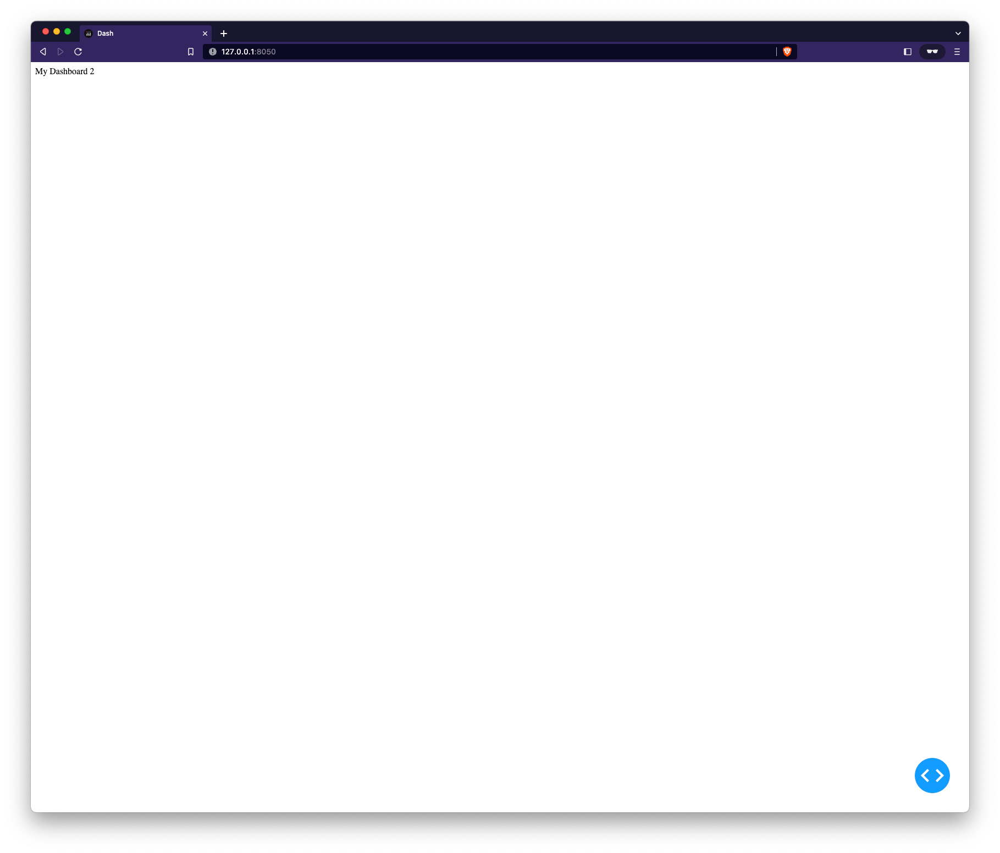

```python
from dash import Dash, html

app = Dash()

app.layout = html.Div('My Dashboard 2')

if __name__ == '__main__':
    app.run_server(debug=True)
```

Dash example:


```python
app.layout = html.Div('My Dashboard')
```



