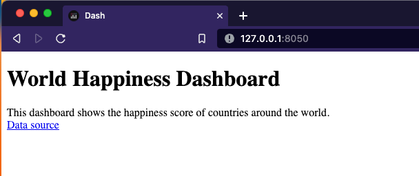
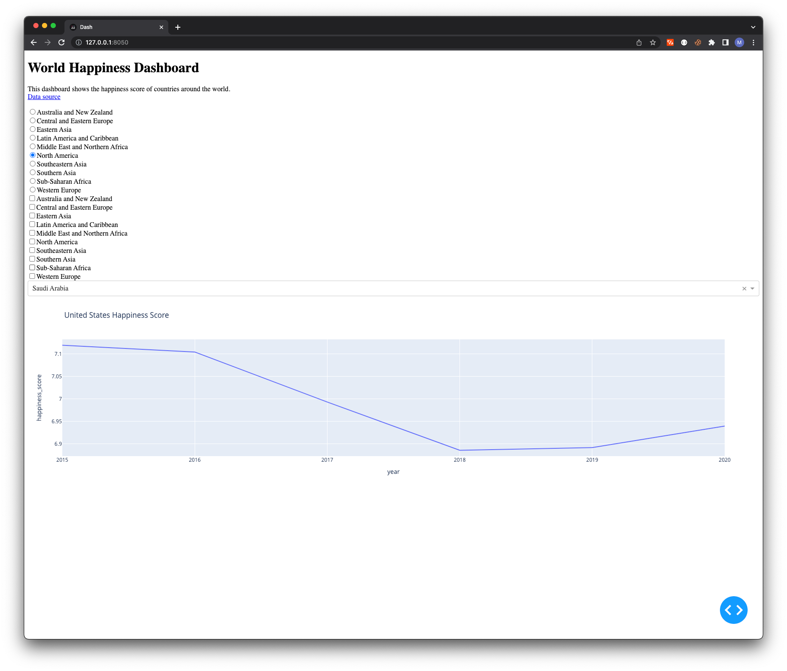

## adding interactivity

```python
dcc.RadioItems(
        options=df['region'].unique(),
        value='North America',
    ),
    dcc.Checklist(
        options=df['region'].unique(),
        value=['North America'],
    ),
    dcc.Dropdown(
        options=df['country'].unique(),
        value='United States',
    ),
    dcc.Graph(
        figure=px.line(
            df[df['country'] == 'United States'],
            x='year', y='happiness_score',
            title="United States Happiness Score"),
    ),
```


