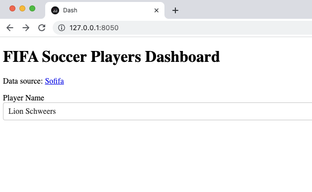
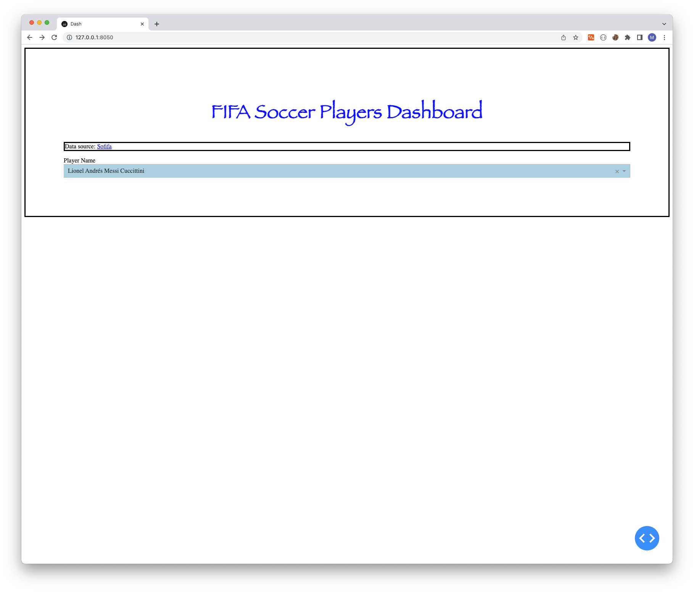

```python
from dash import Dash, html, dcc
import pandas as pd

app = Dash(__name__)

df = pd.read_csv('fifa_soccer_players.csv')

title = html.H1('FIFA Soccer Players Dashboard')
data_source = html.P([
    'Data source: ',
    html.A('Sofifa', href='https://sofifa.com/', target='_blank')
])

name_label = html.Label('Player Name')
name_dropdown = dcc.Dropdown(
    options=df['long_name'].sort_values().unique(),
    value=df['long_name'][0],
)

app.layout = html.Div([
    title,
    data_source,
    name_label,
    name_dropdown,
])

if __name__ == '__main__':
    app.run_server(debug=True)
```



