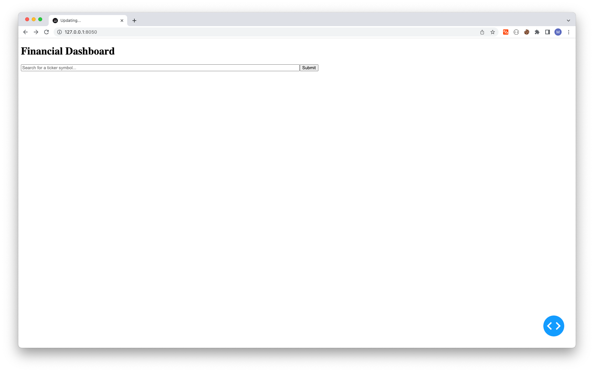
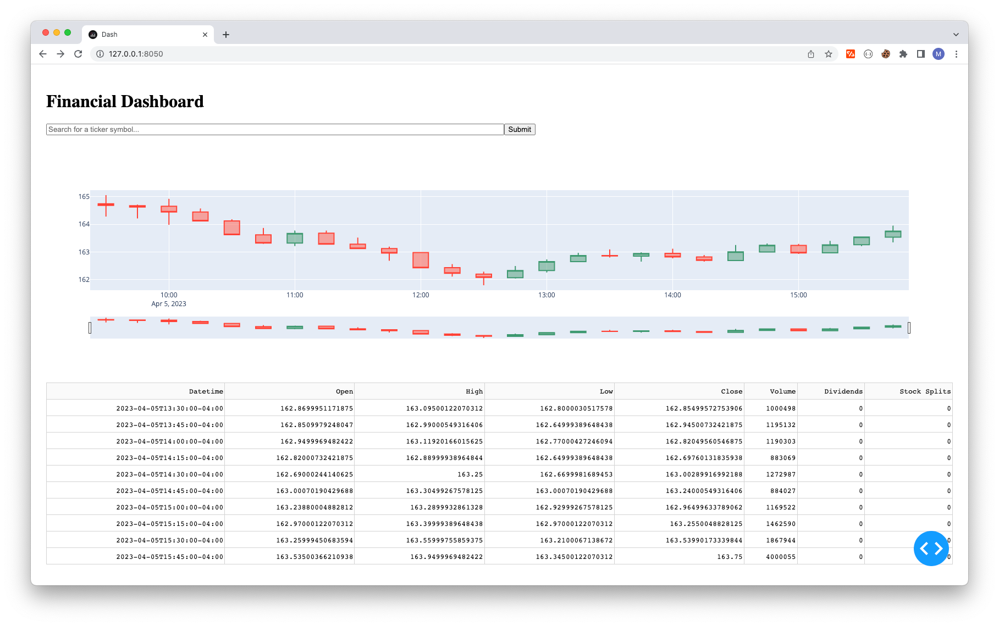
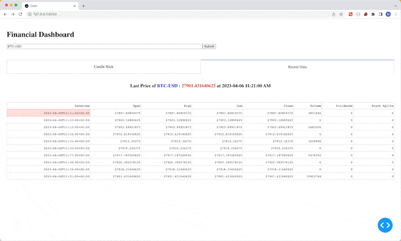

# Financial Dashboard

Showing the financial dashboard is a great way to show the power of the





```python
# Interval Component
interval_chart = dcc.Interval(
    interval=1 * 1000 * 60 * 15,  # in milliseconds [1s * 60s * 15m = 15m]
    n_intervals=0,  # counter that shows how many times the interval has passed, we start at 0
)

interval_table = dcc.Interval(
    interval=1 * 1000 * 60,  # in milliseconds [1s * 60s = 1m]
    n_intervals=0,
)
```



